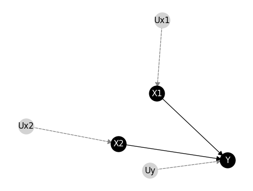

# Bounding Counterfactuals under Selection Bias

This bundle contains the manuscript submited to the PGM2024 and entitled  "A Divide and Conquer Approach for Solving Structural
Causal Models".
The organisation  is the following:

- _examples_: a toy example for running the method proposed in the paper.
- _ctfzeros_: python sources implementing the method.
- _models_: set of structural causal models in UAI format considered in the experimentation.
- _requirements.txt_: code dependencies.


## Setup
First of all, check the Python version. This sources have been coded with the following Python version:


```python
!python --version
```

    Python 3.11.2


Then, install the dependencies in the `requirement.txt` file. The main dependency is the python packege `bcause` (https://github.com/PGM-Lab/bcause).


```python
!pip install --upgrade pip setuptools wheel
!pip install -r ./requirements.txt
```

    Requirement already satisfied: pip in /Users/rcabanas/venv/2024-PGM-DCCC/lib/python3.11/site-packages (24.0)
    Requirement already satisfied: setuptools in /Users/rcabanas/venv/2024-PGM-DCCC/lib/python3.11/site-packages (70.0.0)
    Requirement already satisfied: wheel in /Users/rcabanas/venv/2024-PGM-DCCC/lib/python3.11/site-packages (0.43.0)
    Collecting bcause@ git+https://github.com/PGM-Lab/bcause@dev-czeros (from -r ./requirements.txt (line 1))
      Cloning https://github.com/PGM-Lab/bcause (to revision dev-czeros) to /private/var/folders/f5/bp1mbmt10w1f_m23nwfgsn_h0000gn/T/pip-install-3ws7r8gj/bcause_6ccfdc155b53490ab0019a6cc247a729
      Running command git clone --filter=blob:none --quiet https://github.com/PGM-Lab/bcause /private/var/folders/f5/bp1mbmt10w1f_m23nwfgsn_h0000gn/T/pip-install-3ws7r8gj/bcause_6ccfdc155b53490ab0019a6cc247a729
      Running command git checkout -b dev-czeros --track origin/dev-czeros
      Switched to a new branch 'dev-czeros'
      branch 'dev-czeros' set up to track 'origin/dev-czeros'.
      Resolved https://github.com/PGM-Lab/bcause to commit b264968827b601ce6cdd99cd8d1c023a6ae69199
      Preparing metadata (setup.py) ... [?25ldone
    [?25hRequirement already satisfied: more-itertools==10.2.0 in /Users/rcabanas/venv/2024-PGM-DCCC/lib/python3.11/site-packages (from -r ./requirements.txt (line 2)) (10.2.0)
    Requirement already satisfied: python-sat==0.1.8.dev15 in /Users/rcabanas/venv/2024-PGM-DCCC/lib/python3.11/site-packages (from -r ./requirements.txt (line 3)) (0.1.8.dev15)
    Requirement already satisfied: numpy~=1.26 in /Users/rcabanas/venv/2024-PGM-DCCC/lib/python3.11/site-packages (from -r ./requirements.txt (line 4)) (1.26.4)
    Requirement already satisfied: six in /Users/rcabanas/venv/2024-PGM-DCCC/lib/python3.11/site-packages (from python-sat==0.1.8.dev15->-r ./requirements.txt (line 3)) (1.16.0)
    Requirement already satisfied: pandas~=2.0.3 in /Users/rcabanas/venv/2024-PGM-DCCC/lib/python3.11/site-packages (from bcause@ git+https://github.com/PGM-Lab/bcause@dev-czeros->-r ./requirements.txt (line 1)) (2.0.3)
    Requirement already satisfied: matplotlib~=3.5.2 in /Users/rcabanas/venv/2024-PGM-DCCC/lib/python3.11/site-packages (from bcause@ git+https://github.com/PGM-Lab/bcause@dev-czeros->-r ./requirements.txt (line 1)) (3.5.3)
    Requirement already satisfied: networkx~=2.6.3 in /Users/rcabanas/venv/2024-PGM-DCCC/lib/python3.11/site-packages (from bcause@ git+https://github.com/PGM-Lab/bcause@dev-czeros->-r ./requirements.txt (line 1)) (2.6.3)
    Requirement already satisfied: pgmpy~=0.1.17 in /Users/rcabanas/venv/2024-PGM-DCCC/lib/python3.11/site-packages (from bcause@ git+https://github.com/PGM-Lab/bcause@dev-czeros->-r ./requirements.txt (line 1)) (0.1.25)
    Requirement already satisfied: cycler>=0.10 in /Users/rcabanas/venv/2024-PGM-DCCC/lib/python3.11/site-packages (from matplotlib~=3.5.2->bcause@ git+https://github.com/PGM-Lab/bcause@dev-czeros->-r ./requirements.txt (line 1)) (0.12.1)
    Requirement already satisfied: fonttools>=4.22.0 in /Users/rcabanas/venv/2024-PGM-DCCC/lib/python3.11/site-packages (from matplotlib~=3.5.2->bcause@ git+https://github.com/PGM-Lab/bcause@dev-czeros->-r ./requirements.txt (line 1)) (4.52.4)
    Requirement already satisfied: kiwisolver>=1.0.1 in /Users/rcabanas/venv/2024-PGM-DCCC/lib/python3.11/site-packages (from matplotlib~=3.5.2->bcause@ git+https://github.com/PGM-Lab/bcause@dev-czeros->-r ./requirements.txt (line 1)) (1.4.5)
    Requirement already satisfied: packaging>=20.0 in /Users/rcabanas/venv/2024-PGM-DCCC/lib/python3.11/site-packages (from matplotlib~=3.5.2->bcause@ git+https://github.com/PGM-Lab/bcause@dev-czeros->-r ./requirements.txt (line 1)) (24.0)
    Requirement already satisfied: pillow>=6.2.0 in /Users/rcabanas/venv/2024-PGM-DCCC/lib/python3.11/site-packages (from matplotlib~=3.5.2->bcause@ git+https://github.com/PGM-Lab/bcause@dev-czeros->-r ./requirements.txt (line 1)) (10.3.0)
    Requirement already satisfied: pyparsing>=2.2.1 in /Users/rcabanas/venv/2024-PGM-DCCC/lib/python3.11/site-packages (from matplotlib~=3.5.2->bcause@ git+https://github.com/PGM-Lab/bcause@dev-czeros->-r ./requirements.txt (line 1)) (3.1.2)
    Requirement already satisfied: python-dateutil>=2.7 in /Users/rcabanas/venv/2024-PGM-DCCC/lib/python3.11/site-packages (from matplotlib~=3.5.2->bcause@ git+https://github.com/PGM-Lab/bcause@dev-czeros->-r ./requirements.txt (line 1)) (2.9.0.post0)
    Requirement already satisfied: pytz>=2020.1 in /Users/rcabanas/venv/2024-PGM-DCCC/lib/python3.11/site-packages (from pandas~=2.0.3->bcause@ git+https://github.com/PGM-Lab/bcause@dev-czeros->-r ./requirements.txt (line 1)) (2024.1)
    Requirement already satisfied: tzdata>=2022.1 in /Users/rcabanas/venv/2024-PGM-DCCC/lib/python3.11/site-packages (from pandas~=2.0.3->bcause@ git+https://github.com/PGM-Lab/bcause@dev-czeros->-r ./requirements.txt (line 1)) (2024.1)
    Requirement already satisfied: scipy in /Users/rcabanas/venv/2024-PGM-DCCC/lib/python3.11/site-packages (from pgmpy~=0.1.17->bcause@ git+https://github.com/PGM-Lab/bcause@dev-czeros->-r ./requirements.txt (line 1)) (1.13.1)
    Requirement already satisfied: scikit-learn in /Users/rcabanas/venv/2024-PGM-DCCC/lib/python3.11/site-packages (from pgmpy~=0.1.17->bcause@ git+https://github.com/PGM-Lab/bcause@dev-czeros->-r ./requirements.txt (line 1)) (1.5.0)
    Requirement already satisfied: torch in /Users/rcabanas/venv/2024-PGM-DCCC/lib/python3.11/site-packages (from pgmpy~=0.1.17->bcause@ git+https://github.com/PGM-Lab/bcause@dev-czeros->-r ./requirements.txt (line 1)) (2.3.0)
    Requirement already satisfied: statsmodels in /Users/rcabanas/venv/2024-PGM-DCCC/lib/python3.11/site-packages (from pgmpy~=0.1.17->bcause@ git+https://github.com/PGM-Lab/bcause@dev-czeros->-r ./requirements.txt (line 1)) (0.14.2)
    Requirement already satisfied: tqdm in /Users/rcabanas/venv/2024-PGM-DCCC/lib/python3.11/site-packages (from pgmpy~=0.1.17->bcause@ git+https://github.com/PGM-Lab/bcause@dev-czeros->-r ./requirements.txt (line 1)) (4.66.4)
    Requirement already satisfied: joblib in /Users/rcabanas/venv/2024-PGM-DCCC/lib/python3.11/site-packages (from pgmpy~=0.1.17->bcause@ git+https://github.com/PGM-Lab/bcause@dev-czeros->-r ./requirements.txt (line 1)) (1.4.2)
    Requirement already satisfied: opt-einsum in /Users/rcabanas/venv/2024-PGM-DCCC/lib/python3.11/site-packages (from pgmpy~=0.1.17->bcause@ git+https://github.com/PGM-Lab/bcause@dev-czeros->-r ./requirements.txt (line 1)) (3.3.0)
    Requirement already satisfied: threadpoolctl>=3.1.0 in /Users/rcabanas/venv/2024-PGM-DCCC/lib/python3.11/site-packages (from scikit-learn->pgmpy~=0.1.17->bcause@ git+https://github.com/PGM-Lab/bcause@dev-czeros->-r ./requirements.txt (line 1)) (3.5.0)
    Requirement already satisfied: patsy>=0.5.6 in /Users/rcabanas/venv/2024-PGM-DCCC/lib/python3.11/site-packages (from statsmodels->pgmpy~=0.1.17->bcause@ git+https://github.com/PGM-Lab/bcause@dev-czeros->-r ./requirements.txt (line 1)) (0.5.6)
    Requirement already satisfied: filelock in /Users/rcabanas/venv/2024-PGM-DCCC/lib/python3.11/site-packages (from torch->pgmpy~=0.1.17->bcause@ git+https://github.com/PGM-Lab/bcause@dev-czeros->-r ./requirements.txt (line 1)) (3.14.0)
    Requirement already satisfied: typing-extensions>=4.8.0 in /Users/rcabanas/venv/2024-PGM-DCCC/lib/python3.11/site-packages (from torch->pgmpy~=0.1.17->bcause@ git+https://github.com/PGM-Lab/bcause@dev-czeros->-r ./requirements.txt (line 1)) (4.12.0)
    Requirement already satisfied: sympy in /Users/rcabanas/venv/2024-PGM-DCCC/lib/python3.11/site-packages (from torch->pgmpy~=0.1.17->bcause@ git+https://github.com/PGM-Lab/bcause@dev-czeros->-r ./requirements.txt (line 1)) (1.12)
    Requirement already satisfied: jinja2 in /Users/rcabanas/venv/2024-PGM-DCCC/lib/python3.11/site-packages (from torch->pgmpy~=0.1.17->bcause@ git+https://github.com/PGM-Lab/bcause@dev-czeros->-r ./requirements.txt (line 1)) (3.1.4)
    Requirement already satisfied: fsspec in /Users/rcabanas/venv/2024-PGM-DCCC/lib/python3.11/site-packages (from torch->pgmpy~=0.1.17->bcause@ git+https://github.com/PGM-Lab/bcause@dev-czeros->-r ./requirements.txt (line 1)) (2024.5.0)
    Requirement already satisfied: MarkupSafe>=2.0 in /Users/rcabanas/venv/2024-PGM-DCCC/lib/python3.11/site-packages (from jinja2->torch->pgmpy~=0.1.17->bcause@ git+https://github.com/PGM-Lab/bcause@dev-czeros->-r ./requirements.txt (line 1)) (2.1.5)
    Requirement already satisfied: mpmath>=0.19 in /Users/rcabanas/venv/2024-PGM-DCCC/lib/python3.11/site-packages (from sympy->torch->pgmpy~=0.1.17->bcause@ git+https://github.com/PGM-Lab/bcause@dev-czeros->-r ./requirements.txt (line 1)) (1.3.0)


## Model and data

In this repository, we provide functionality for preprocessing the model and data so they could work we our inference algorithm:


```python
from ctfzeros.prepro import load_and_preprocess
```


```python
filepath = "./models/synthetic/simple_nparents2_nzr04_zdr05_10.uai"
datapath = "./models/synthetic/simple_nparents2_nzr04_zdr05_10.csv"

model, data, _, _ = load_and_preprocess(filepath, datapath)
model
```


    <StructuralCausalModel (Y:2,X2:2,X1:2|Uy:14,Ux1:2,Ux2:2), dag=[Uy][Y|Uy:X2:X1][X2|Ux2][X1|Ux1][Ux1][Ux2]>


```python
model.draw()
```



```python
data
```


<div>
<style scoped>
    .dataframe tbody tr th:only-of-type {
        vertical-align: middle;
    }

    .dataframe tbody tr th {
        vertical-align: top;
    }

    .dataframe thead th {
        text-align: right;
    }
</style>
<table border="1" class="dataframe">
  <thead>
    <tr style="text-align: right;">
      <th></th>
      <th>X2</th>
      <th>X1</th>
      <th>Y</th>
    </tr>
  </thead>
  <tbody>
    <tr>
      <th>0</th>
      <td>0</td>
      <td>1</td>
      <td>1</td>
    </tr>
    <tr>
      <th>1</th>
      <td>0</td>
      <td>0</td>
      <td>1</td>
    </tr>
    <tr>
      <th>2</th>
      <td>0</td>
      <td>0</td>
      <td>1</td>
    </tr>
    <tr>
      <th>3</th>
      <td>0</td>
      <td>0</td>
      <td>1</td>
    </tr>
    <tr>
      <th>4</th>
      <td>0</td>
      <td>0</td>
      <td>1</td>
    </tr>
    <tr>
      <th>...</th>
      <td>...</td>
      <td>...</td>
      <td>...</td>
    </tr>
    <tr>
      <th>995</th>
      <td>0</td>
      <td>1</td>
      <td>1</td>
    </tr>
    <tr>
      <th>996</th>
      <td>0</td>
      <td>0</td>
      <td>1</td>
    </tr>
    <tr>
      <th>997</th>
      <td>1</td>
      <td>0</td>
      <td>1</td>
    </tr>
    <tr>
      <th>998</th>
      <td>0</td>
      <td>0</td>
      <td>0</td>
    </tr>
    <tr>
      <th>999</th>
      <td>0</td>
      <td>0</td>
      <td>1</td>
    </tr>
  </tbody>
</table>
<p>1000 rows × 3 columns</p>
</div>


## Counterfactual inference

First, load corresponding modules for using DCCC and EMCC:


```python
from ctfzeros.divideconquer import DCCC_inverted_tree
from bcause.inference.causal.multi import EMCC
```

Set up the DCCC inference engine with a number of solutions $N=20$. Then calculate the probability of sufficiency $PS(X_2,Y)$:


```python
infDCCC = DCCC_inverted_tree(model, data, num_runs=20)
infDCCC.prob_sufficiency("X2","Y")
```


    [0.8247598578471568, 1.0]


Similarly, with the state of the art method EMCC interating up to 100 iterations each EM run.


```python
infEMCC = EMCC(model,data,num_runs=20, max_iter=100)
infEMCC.prob_sufficiency("X2","Y")

```


    [0.9105167456058657, 0.9975199671164047]


